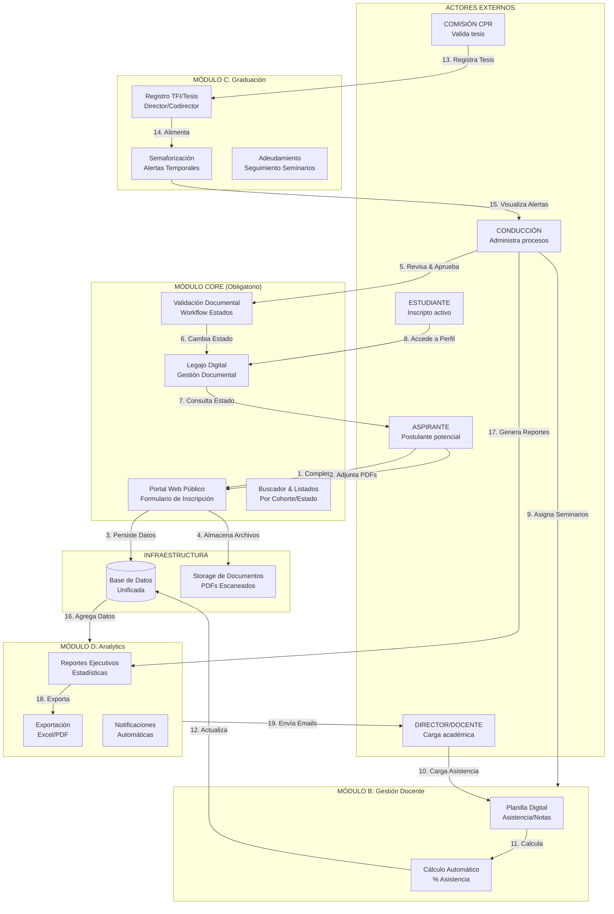
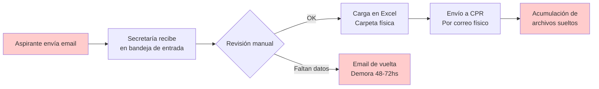
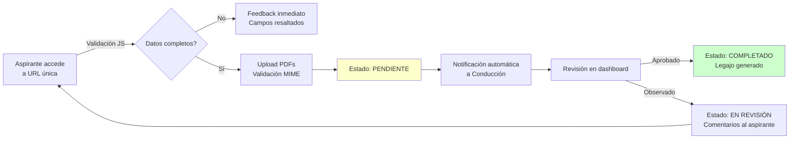
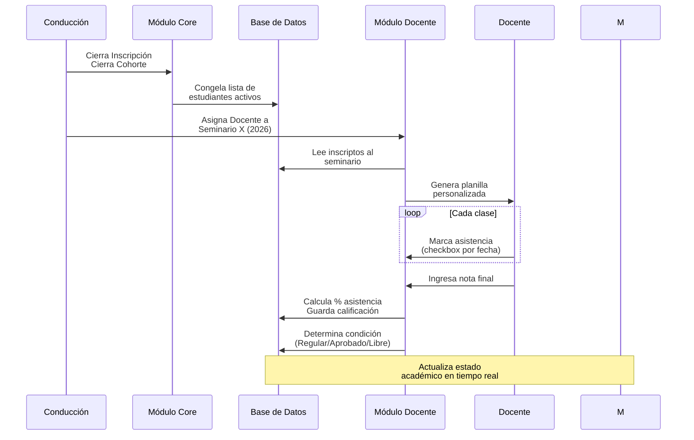
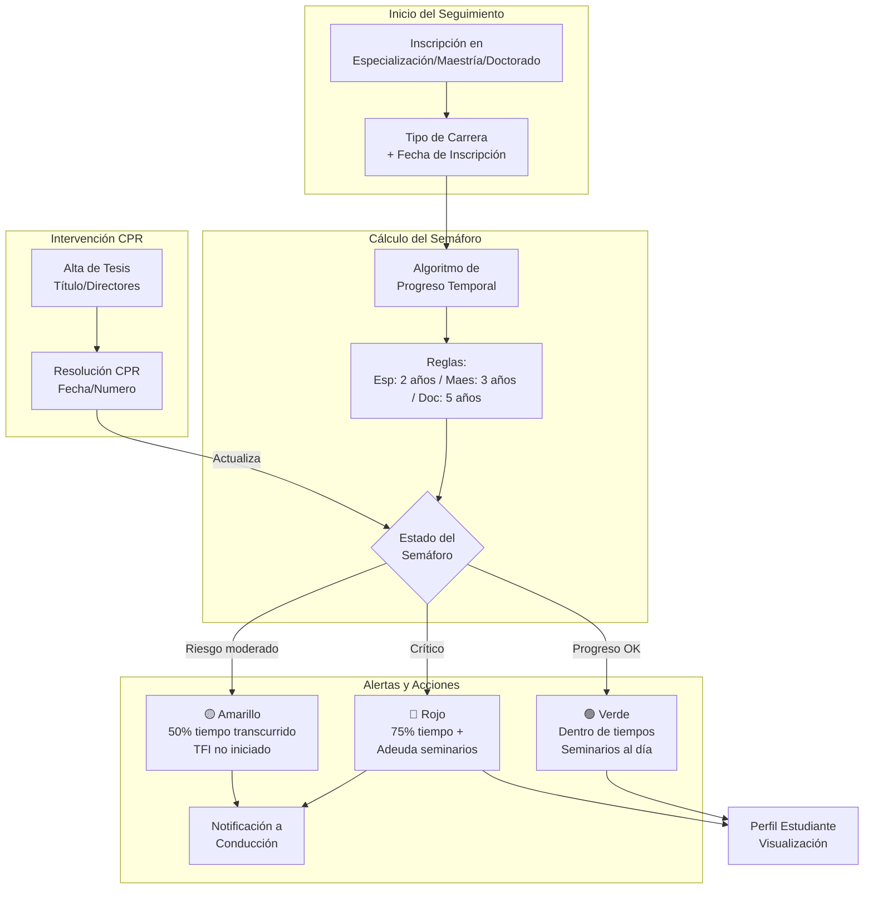
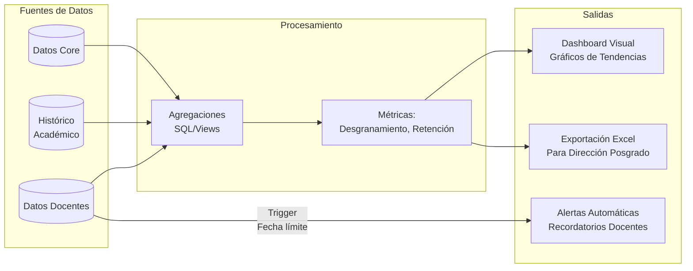
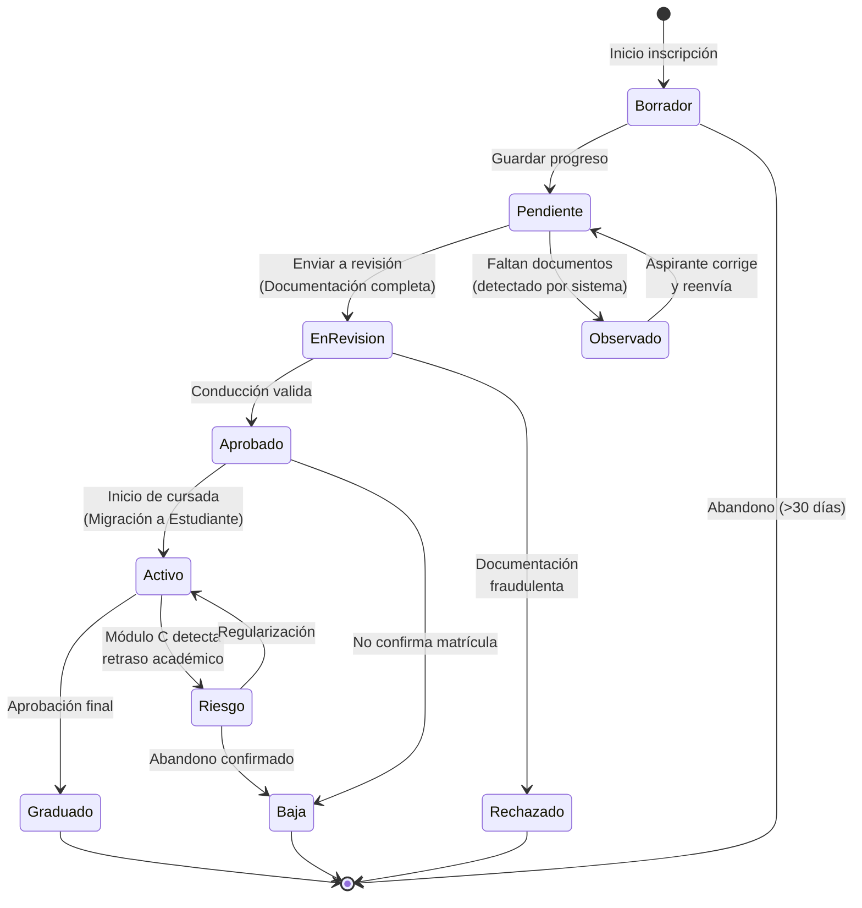

**Business Flow Diagram (BFD)** completo del proyecto "Fenix Posgrado", diseñado como documento de arquitectura de negocio para que los equipos de desarrollo comprendan las interacciones sistémicas antes de codificar.

---

## 1. Diagrama General de Flujo de Negocio (Nivel 0)



---

## 2. Descomposición de Procesos por Módulo

### 2.1 Módulo Core: Proceso de Admisión (AS-IS vs TO-BE)

#### Flujo Actual (AS-IS) - Problemático


#### Flujo Propuesto (TO-BE) - Digitalizado


**Puntos de Decisión (Gateways) críticos:**
- **G1:** ¿Documentación válida? (Chequeo de virus/formato)
- **G2:** ¿Cupos disponibles en cohorte? (Validación contra BD)
- **G3:** ¿Requiere beca? (Derivación a flujo paralelo de evaluación económica)

---

### 2.2 Interacción Módulo Core ↔ Módulo B (Docentes)



---

### 2.3 Flujo del Módulo C (Seguimiento de Graduación)



**Regla de Negocio Crítica (para el ASR):**
```
Si (Fecha_Actual - Fecha_Inscripción) > (Duración_Carrera * 0.75) 
   Y (Seminarios_Aprobados < Total_Seminarios_Obligatorios * 0.8) 
Entonces Estado = ROJO
```

---

### 2.4 Flujo del Módulo D (Analytics y Reporting)



---

## 3. Matriz de Responsabilidades (RACI simplificado)

| Proceso | Aspirante | Estudiante | Docente | Conducción | CPR | Sistema (Auto) |
|---------|-----------|------------|---------|------------|-----|----------------|
| **Inscripción Inicial** | R | - | - | A | - | C |
| **Validación Documental** | C | - | - | R/A | I | C |
| **Carga Académica** | - | I | R/A | I | - | C |
| **Seguimiento Tesis** | - | I | C | I | R/A | C |
| **Generación Reportes** | - | - | I | R/A | I | C |
| **Alertas Temporales** | I | I | I | I | I | R/A |

*Leyenda: R=Responsable, A=Aprueba, C=Consultado/Informado, I=Informado*

---

## 4. Diagrama de Estados del Legajo (State Machine)

Crítico para el desarrollo del Módulo Core:



---

## 5. Puntos de Integración entre Módulos (API Contracts)

Para que los equipos puedan trabajar en paralelo, defino los contratos de integración:

### 5.1 Core → Docente (Módulo B)
```
GET /api/core/estudiantes/{cohorte}/{seminario_id}
Headers: Authorization: Bearer {token_docente}
Response: {
  "estudiantes": [
    {
      "legajo_id": "uuid",
      "nombre_completo": "string",
      "email": "string",
      "carrera_grado": "string",
      "estado_legajo": "Activo"
    }
  ]
}
```

### 5.2 Docente → Core (Actualización)
```
POST /api/docentes/asistencias
Body: {
  "seminario_id": "uuid",
  "fecha_clase": "2026-04-07",
  "asistencias": [
    {"legajo_id": "uuid", "presente": true}
  ]
}
```

### 5.3 Core → Graduación (Módulo C)
```
Trigger: Evento "Estudiante Activo"
Payload: {
  "estudiante_id": "uuid",
  "tipo_carrera": "Especializacion|Maestria|Doctorado",
  "fecha_inscripcion": "2026-03-15",
  "seminarios_obligatorios": 8
}
```

---

## 6. Checklist de Validación del BFD

Antes de comenzar el desarrollo, cada equipo debe verificar que entiende:

- [ ] **¿Qué dispara el cambio de estado "Aspirante" a "Estudiante"?** (Resp: Aprobación de legajo + Confirmación de matrícula)
- [ ] **¿Quién puede ver los PDFs subidos?** (Resp: Solo Conducción y el propio Aspirante durante edición)
- [ ] **¿Qué sucede si un docente no carga asistencia en 48hs?** (Resp: Módulo D envía recordatorio automático - si se implementa D)
- [ ] **¿Cómo se calcula el color del semáforo?** (Resp: Regla basada en fecha inscripción vs. progreso académico)
- [ ] **¿Los aspirantes pueden ver el semáforo?** (Resp: No, es información interna de Conducción/CPR según requerimiento)