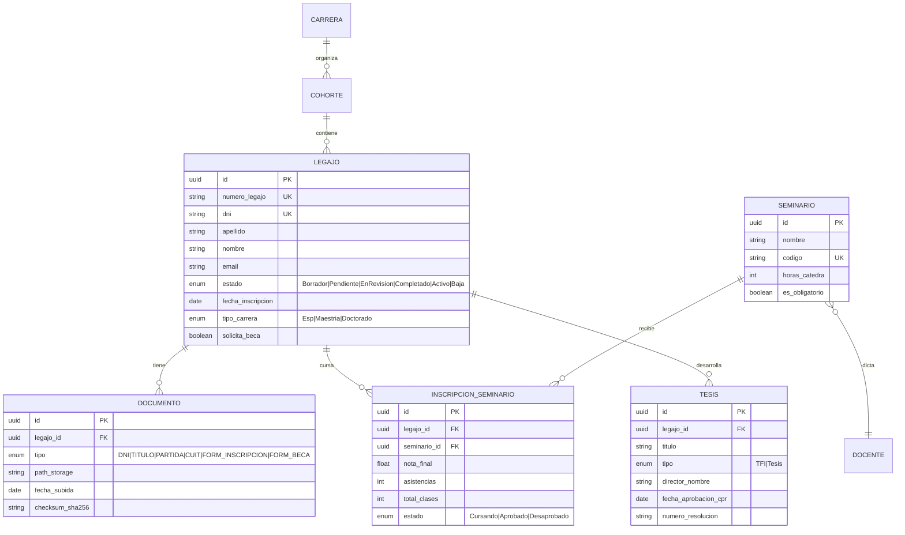

Presentamos el  **Product Requirements Document (PRD)** completo para el proyecto **"Sistema de Posgrado"**, estructurado según estándares IEEE 830-1998 y metodologías modernas de gestión de producto (Atlassian, SAFe). Este documento sirve como referencia contractual entre el negocio (Secretaría de Posgrado UTN-FRLP) y los equipos de desarrollo (estudiantes).

---

# PRD-001: Sistema de Gestión Académica de Posgrado (Sistema)
**Versión:** 2.0  
**Fecha:** 07/04/2026  
**Estado:** Aprobado para desarrollo  
**Autor:** Secretaría de Posgrado UTN-FRLP + Cátedra de Desarrollo de Software  
**Stakeholder Principal:** Dirección de Posgrado UTN-FRLP  

---

## 1. Historial de Versiones

| Versión | Fecha | Autor | Descripción de Cambios |
|---------|-------|-------|------------------------|
| 0.1 | 01/03/2026 | Equipo Docente | Versión inicial basada en relevamiento AS-IS |
| 1.0 | 15/03/2026 | Conducción Posgrado | Aprobación alcance MVP académico |
| 2.0 | 07/04/2026 | Arquitecto Curso | Modularización para desarrollo por equipos |

---

## 2. Executive Summary

**Problema:** La gestión de posgrado actual depende de Excel, correos electrónicos y carpetas físicas, generando duplicación de datos, pérdida de trazabilidad y demoras de 5-10 días en procesos que deberían ser instantáneos.

**Solución:** Plataforma web centralizada que digitaliza el ciclo de vida del estudiante desde la pre-inscripción hasta la graduación, con accesos diferenciados por rol y automatización de cálculos académicos críticos.

**Alcance MVP:** Gestión completa de una cohorte (2026), incluyendo inscripción, seguimiento de asistencia/Notas para 3 seminarios, y reportes básicos de estado académico.

---

## 3. Contexto y Motivación (Business Case)

### 3.1 Situación Actual (AS-IS)
- **Proceso de inscripción:** 72hs de demora promedio entre solicitud y respuesta.
- **Gestión documental:** 15% de carpetas físicas presentan documentación faltante o desactualizada.
- **Carga académica:** Los docentes reciben 3-4 versiones diferentes de planillas Excel por semestre.
- **Toma de decisiones:** El cálculo de "estado de riesgo" de estudiantes demorados requiere 4 horas manuales por cohorte.

### 3.2 Objetivos de Negocio (OKRs)
1. **OKR-1:** Reducir el tiempo de inscripción inicial de 72hs a <15 minutos para el 95% de los casos.
2. **OKR-2:** Eliminar el 100% de planillas Excel para seguimiento de asistencia en el primer cuatrimestre de uso.
3. **OKR-3:** Proveer visibilidad en tiempo real del estado de riesgo académico (semáforo) sin intervención manual.

---

## 4. Stakeholders y Personas

### 4.1 Matriz de Stakeholders

| Rol | Descripción | Necesidad Principal | Frecuencia de Uso |
|-----|-------------|---------------------|-------------------|
| **ASP-001** Aspirante | Postulante a carrera de posgrado | Inscripción simple y trazable | Una vez (pero crítica) |
| **EST-001** Estudiante Activo | Inscripto cursando seminarios | Visualizar su progreso | Semanal |
| **DOC-001** Director de Seminario | Responsable académico de asignatura | Carga eficiente de notas/asistencia | Semanal (días de clase) |
| **CON-001** Coordinador de Carrera | Gestiona proceso completo | Dashboards y alertas | Diaria |
| **CPR-001** Comisión Posgrado Regional | Valida trabajos finales | Registro formal de tesis | Mensual |

### 4.2 User Persona Detallada (Ejemplo Crítico)

**Nombre:** María Ayelén Díaz Lapérgola (CON-001)  
**Contexto:** Coordina la Especialización en Sistemas de Información (60 estudiantes, 8 seminarios).  
**Dolor actual:** "Necesito 3 horas cada fin de mes para cruzar planillas de asistencias con actas de examen para saber quién está en condición de dar el final."  
**Expectativa:** "Quiero ver en una pantalla quiénes están en riesgo de recursar antes de que sea tarde para recuperarlos."

---

## 5. Alcance del Proyecto (Scope Definition)

### 5.1 In-Scope (MVP Académico)
**Módulo Core (Obligatorio para todos los equipos):**
- Formulario de inscripción responsive con validación de campos.
- Sistema de estados del legajo: Borrador → Pendiente → En Revisión → Completado → Activo.
- Upload y gestión de documentos PDF (DNI, Título, etc.) con validación de integridad.
- Buscador por DNI/Apellido y listados filtrables por cohorte.

**Módulos de Especialización (Uno por equipo):**

| ID | Módulo | Funcionalidades Incluidas |
|----|--------|---------------------------|
| MOD-B | Gestión Docente | Planilla de asistencia (grid editable), carga de notas finales, cálculo automático de % asistencia, exportación a Excel. |
| MOD-C | Seguimiento Graduación | Registro de TFI/Tesis, algoritmo de semaforización por plazos normativos, alertas de vencimiento. |
| MOD-D | Analytics & Reporting | Dashboard de inscripciones por cohorte, tasa de retención/desgranamiento, notificaciones automáticas a docentes. |

### 5.2 Out-of-Scope (Explicitamente Excluido)
- **Integración:** No se conectará con sistemas institucionales legacy en esta versión (carga manual de actas).
- **Firma Digital Certificada:** Se usa upload de PDF firmado en forma analógica escaneado.
- **Pasarela de Pagos:** La gestión de pagos de matrícula permanece en sistema financiero externo.
- **App Móvil Nativa:** Solo web responsive (mobile-first).
- **Multi-idioma:** Solo español.

---

## 6. Requisitos Funcionales (Functional Requirements)

### 6.1 Estructura de Requisitos
Cada requisito sigue el formato:  
**[ID] [Prioridad] Título**  
*Como [rol], quiero [acción], para que [beneficio].*

**Criterios de Aceptación (Gherkin):**
```
Dado [contexto inicial]
Cuando [acción/evento]
Entonces [resultado esperado]
```

### 6.2 Épica: Gestión de Admisión (Módulo Core)

#### **REQ-CORE-001** [Must] Registro de Aspirante
*Como aspirante, quiero completar mis datos personales en un formulario web, para que quede registrada mi intención de inscripción.*

**Criterios de Aceptación:**
1. **Dado** un aspirante en la página de inscripción, **cuando** ingresa DNI, **entonces** el sistema valida formato (7-8 dígitos) y unicidad (no puede existir otro aspirante con mismo DNI en cohorte abierta).
2. **Dado** que el correo electrónico es obligatorio, **cuando** el formato no es válido, **entonces** se muestra error inmediato (HTML5 + validación servidor).
3. **Dado** que el aspirante selecciona "Solicita beca", **cuando** marca el checkbox, **entonces** aparece campo adicional para adjuntar formulario de beca específico.

**Campos Obligatorios:** Apellido, Nombre, DNI, Email, Teléfono móvil, Título de grado, Carrera de posgrado elegida, Motivación (texto libre, mínimo 50 caracteres).

#### **REQ-CORE-002** [Must] Gestión Documental
*Como aspirante, quiero adjuntar mis documentos en PDF, para completar mi legajo digital.*

**Criterios de Aceptación:**
1. **Dado** que el aspirante selecciona "Adjuntar DNI", **cuando** el archivo no es PDF o excede 5MB, **entonces** el sistema rechaza el upload con mensaje específico antes de transferir.
2. **Dado** que el documento se sube correctamente, **cuando** se completa la transferencia, **entonces** el sistema genera thumbnail/visualización del PDF y almacena el archivo con nombre UUID en servidor seguro.
3. **Dado** que existen documentos obligatorios (DNI, Título), **cuando** el aspirante intenta "Enviar a revisión", **entonces** el sistema valida presencia de todos los PDFs obligatorios marcados.

#### **REQ-CORE-003** [Must] Workflow de Estados del Legajo
*Como coordinador de carrera, quiero cambiar el estado de los legajos, para controlar el proceso de admisión.*

**Máquina de Estados (Workflow):**
```
[Borrador] --(Guardar)--> [Pendiente]
[Pendiente] --(Revisar)--> [En Revisión] 
[En Revisión] --(Aprobar)--> [Completado]
[En Revisión] --(Observar)--> [Observado] --> [Pendiente]
[Completado] --(Matricular)--> [Activo]
```

**Criterios de Aceptación:**
1. **Dado** un legajo en estado "Pendiente", **cuando** el coordinador lo aprueba, **entonces** se genera automáticamente número de legajo único (formato: AÑO-COHORTE-SECUENCIAL, ej: 26-001-045).
2. **Dado** un cambio de estado a "Observado", **cuando** el coordinador guarda, **entonces** el sistema envía email automático al aspirante con el texto de la observación.
3. **Dado** un legajo "Completado", **cuando** pasa 30 días sin pasar a "Activo", **entonces** el sistema alerta al coordinador por vencimiento de reserva de vacante.

#### **REQ-CORE-004** [Should] Búsqueda y Filtrado
*Como coordinador, quiero buscar estudiantes por múltiples criterios, para encontrar información rápidamente.*

**Criterios de Aceptación:**
1. Búsqueda por DNI exacto o Apellido (parcial, case-insensitive) con resultados en <2 segundos.
2. Filtros disponibles: Estado del legajo, Cohorte, Carrera de posgrado, Tiene beca (Sí/No).
3. Exportación a Excel del resultado de búsqueda (máximo 500 registros).

---

### 6.3 Épica: Gestión Docente (Módulo B)

#### **REQ-DOC-001** [Must] Planilla de Asistencia Digital
*Como docente, quiero cargar la asistencia de mis alumnos por clase, para no usar planillas Excel.*

**Criterios de Aceptación:**
1. **Dado** que el docente accede a su seminario asignado, **cuando** selecciona "Nueva clase", **entonces** el sistema crea una columna nueva en la grilla con fecha por defecto (hoy, editable).
2. **Dado** la grilla de asistencia, **cuando** el docente marca presente/ausente, **entonces** el cambio se guarda automáticamente (autosave) sin necesidad de botón "Guardar".
3. **Dado** que existen 10 clases cargadas, **cuando** el sistema calcula, **entonces** muestra porcentaje de asistencia por estudiante (Presentes/Total clases dictadas).

#### **REQ-DOC-002** [Must] Carga de Calificaciones Finales
*Como docente, quiero registrar las notas finales de mi seminario, para que impacten en el legajo del estudiante.*

**Criterios de Aceptación:**
1. Solo se permiten valores numéricos entre 1 y 10, con un decimal (ej: 7.5).
2. **Dado** una nota <4, **cuando** se guarda, **entonces** el estado del seminario para ese estudiante cambia a "Desaprobado".
3. **Dado** una nota ≥4, **cuando** se guarda, **entonces** el estado cambia a "Aprobado" y aparece disponible para acta de examen.

#### **REQ-DOC-003** [Should] Recordatorios Automáticos
*Como coordinador, quiero que el sistema recuerde a los docentes cargar notas, para evitar retrasos en actas.*

**Criterios de Aceptación:** Si faltan 48 horas para la fecha límite de carga de actas y el docente no cargó todas las notas, enviar email recordatorio diario hasta completar.

---

### 6.4 Épica: Seguimiento de Graduación (Módulo C)

#### **REQ-GRAD-001** [Must] Registro de Trabajos Finales
*Como CPR, quiero registrar los datos de las tesis/TFI, para tener centralizada la información de graduación.*

**Datos requeridos:** Título del trabajo, Tipo (TFI/Tesis Doctoral), Director (nombre y email), Codirector (opcional), Fecha aprobación CPR, Número de resolución.

#### **REQ-GRAD-002** [Must] Algoritmo de Semaforización
*Como coordinador, quiero ver el estado de riesgo de cada estudiante, para intervenir oportunamente.*

**Reglas de Negocio (Business Rules):**

| Tipo Carrera | Duración | Umbral Amarillo | Umbral Rojo |
|--------------|----------|-----------------|-------------|
| Especialización | 2 años (730 días) | 50% tiempo transcurrido + TFI no iniciado | 75% tiempo + adeuda >1 seminario |
| Maestría | 3 años (1095 días) | 50% tiempo + Tesis sin director asignado | 80% tiempo + adeuda seminarios |
| Doctorado | 5 años (1825 días) | 40% tiempo + sin avance de tesis registrado | 70% tiempo + sin fecha CPR |

**Criterios de Aceptación:**
1. **Dado** un estudiante de Especialización inscripto hace 400 días, **cuando** no tiene TFI registrado, **entonces** su indicador es 🟡 Amarillo.
2. **Dado** el mismo estudiante a los 550 días, **cuando** aún no aprobó el seminario obligatorio "Metodología", **entonces** cambia a 🔴 Rojo y aparece en dashboard de alertas.
3. **Dado** un estado Rojo, **cuando** el estudiante aprueba el seminario pendiente, **entonces** vuelve a 🟡 Amarillo (nunca verde automáticamente, solo manual por coordinador).

---

### 6.5 Épica: Inteligencia Académica (Módulo D)

#### **REQ-REP-001** [Must] Dashboard de Estadísticas
*Como director de posgrado, quiero ver métricas de la carrera, para reportar a autoridades.*

**Métricas requeridas:**
- Inscripciones por cohorte (comparativa últimos 3 años).
- Tasa de retención (estudiantes que iniciaron vs. graduados).
- Promedio de tiempo de graduación por tipo de carrera.
- Listado de estudiantes en riesgo (semáforo rojo).

#### **REQ-REP-002** [Should] Exportación Programada
*Como secretaria administrativa, quiero descargar reportes en Excel, para presentaciones institucionales.*

**Formato:** Excel (.xlsx) con formatos aplicados (headers en negrita, anchos de columna ajustados, filtros automáticos habilitados).

---

## 7. Requisitos No Funcionales (Non-Functional Requirements)

### 7.1 Rendimiento (Performance)
- **NFR-PERF-001:** El formulario de inscripción debe cargar en <3 segundos en conexión 3G.
- **NFR-PERF-002:** La grilla de asistencia para 50 estudiantes debe soportar edición simultánea sin latencia percibida (<500ms por operación).
- **NFR-PERF-003:** Búsquedas en base de datos <2 segundos para tablas con 10,000 registros.

### 7.2 Seguridad (Security)
- **NFR-SEC-001:** Todos los endpoints deben requerir autenticación JWT, excepto el formulario de inscripción inicial (público).
- **NFR-SEC-002:** Los documentos PDF no deben ser accesibles por URL directa (`/uploads/file.pdf` bloqueado); deben servirse mediante endpoint con validación de permisos.
- **NFR-SEC-003:** Implementar protección contra SQL Injection (uso obligatorio de ORM con prepared statements).
- **NFR-SEC-004:** Contraseñas hasheadas con bcrypt (cost factor ≥12).
- **NFR-SEC-005:** Headers de seguridad HTTP obligatorios: X-Content-Type-Options, X-Frame-Options, CSP.

### 7.3 Usabilidad (Usability)
- **NFR-USA-001:** Diseño responsive: debe funcionar en tablets (uso docente en aula) y móviles (consulta rápida).
- **NFR-USA-002:** Mensajes de error en español, claros y orientados a la acción (ej: "El archivo 'DNI.pdf' es demasiado grande. Máximo permitido: 5MB").
- **NFR-USA-003:** Accesibilidad básica WCAG 2.1 AA: contraste de colores, labels asociados a inputs, navegación por teclado.

### 7.4 Disponibilidad y Confiabilidad (Reliability)
- **NFR-REL-001:** Backup diario automático de base de datos y documentos.
- **NFR-REL-002:** Tolerancia a fallos: si el servicio de email cae, las operaciones críticas continúan y se reintentan en 1 hora.

### 7.5 Mantenibilidad (Maintainability)
- **NFR-MAN-001:** Cobertura de tests unitarios ≥70% en lógica de negocio (reglas de semáforo, cálculos de asistencia).
- **NFR-MAN-002:** Documentación de API con OpenAPI 3.0 (Swagger UI accesible en `/api/docs`).
- **NFR-MAN-003:** Código debe seguir guía de estilo (ESLint/Prettier para JS/TS, PEP8 para Python).

---

## 8. Reglas de Negocio Explícitas (Business Rules)

Código | Descripción | Tipo | Módulo Afectado
-------|-------------|------|----------------
**BR-001** | Un aspirante no puede inscribirse a más de 2 carreras de posgrado simultáneamente en el mismo período de inscripción. | Restricción | Core
**BR-002** | El porcentaje de asistencia se calcula como: (Clases presentes / Clases dictadas hasta la fecha) × 100. No se consideran clases futuras. | Cálculo | B
**BR-003** | Para aprobar un seminario se requiere: Asistencia ≥75% AND Nota final ≥4. | Condición | B
**BR-004** | Solo usuarios con rol "CPR" pueden modificar datos de tesis (título, director, resolución). | Autorización | C
**BR-005** | La reserva de vacante tiene vigencia de 30 días corridos desde el estado "Completado". Pasado ese plazo, el legajo pasa automáticamente a "Vencido". | Temporal | Core
**BR-006** | Los documentos adjuntos deben conservarse por 5 años después de la graduación del estudiante (normativa archival). | Legal | Core
**BR-007** | Un docente solo puede ver/Modificar datos de estudiantes inscriptos en los seminarios que él coordina (aislamiento de datos). | Seguridad | B

---

## 9. Modelo de Datos Conceptual (ERD Simplificado)



---

## 10. Interfaces e Integraciones

### 10.1 API Interna (Entre Módulos)

**Contrato: Core → Docente**
```
GET /api/v1/core/cohortes/{cohorte_id}/seminarios/{id}/estudiantes
Authorization: Bearer {token_docente}
Response: 200 OK
{
  "data": [
    {
      "legajo_id": "uuid",
      "numero_legajo": "26-001-012",
      "apellido_nombre": "Gonzalez, Maria",
      "email": "m.gonzalez@example.com",
      "carrera_grado": "Ing. Sistemas",
      "documentacion_completa": true
    }
  ]
}
```

### 10.2 Interfaces Externas
- **Servicio de Email:** SMTP institucional (UTN-FRLP) para notificaciones.
- **Storage:** Filesystem local (desarrollo) / MinIO o S3 (producción futura).
- **No se integra con:** CVG, SIU-Guaraní u otro sistema (carga manual de actas en este MVP).

---

## 11. Criterios de Aceptación Generales (Definition of Done)

Para considerar una funcionalidad como "completa" (Done), debe cumplir:

1. **Funcional:** Cumple todos los criterios de aceptación definidos en el RF correspondiente.
2. **Código:** Commiteado en rama `develop`, mergeado a `main` via Pull Request con code review de al menos 1 compañero.
3. **Testing:** 
   - Tests unitarios pasando (>70% cobertura en nueva lógica).
   - Tests de integración para endpoints API.
   - Prueba manual de usuario (UX walkthrough) documentada.
4. **Documentación:** 
   - Actualización de CHANGELOG.md.
   - Actualización de README.md si hay nuevas variables de entorno.
   - Documentación de API (Swagger) actualizada.
5. **Calidad:**
   - Sin issues críticos de seguridad (OWASP Top 10).
   - Lighthouse score >80 en Performance y Accesibilidad (para features de UI).
6. **Despliegue:** Funcionando en ambiente de staging (si aplica al módulo).

---

## 12. Roadmap y Estrategia de Releases

### Fase 1: Fundación (Semanas 1-4)
- Setup arquitectura (Clean Architecture).
- Módulo Core: Autenticación básica + Formulario de inscripción (sin upload).
- **Release Tag:** `v0.1-alpha`

### Fase 2: Legajo Digital (Semanas 5-9)
- Upload de documentos.
- Workflow completo de estados.
- Buscador básico.
- **Release Tag:** `v0.5-beta` (Core funcional)

### Fase 3: Especialización (Semanas 10-19)
- Desarrollo paralelo de Módulos B, C o D según asignación de equipo.
- Integración entre módulos via API.
- **Release Tag:** `v0.8-rc`

### Fase 4: Hardering (Semanas 20-27)
- Testing completo (seguridad, carga).
- Corrección de bugs.
- Documentación técnica C4.
- **Release Tag:** `v1.0-ga` (General Availability)

### Fase 5: Entrega Final (Semanas 28-32)
- Deploy en producción (servidor facultad o cloud).
- Transferencia de conocimiento (manual de administración).
- **Release Tag:** `v1.0.0`

---

## 13. Riesgos y Supuestos

### Riesgos Técnicos
| ID | Riesgo | Mitigación |
|----|--------|------------|
| R-001 | El upload de PDFs grandes (>5MB) timeoutea en redes lentas | Implementar upload por chunks o aumentar timeout + compresión cliente |
| R-002 | Concurrencia en planilla de asistencia (2 docentes editan) | Implementar optimistic locking (ETag/Versionado) o bloqueo por fila |

### Supuestos (Assumptions)
- **A-001:** Los usuarios tienen acceso a internet estable durante el uso (no modo offline requerido).
- **A-002:** El volumen de datos no excederá 10,000 estudiantes activos en los próximos 3 años (arquitectura no necesita sharding).
- **A-003:** El navegador objetivo es Chrome/Firefox/Edge últimas 2 versiones (no se soporta IE11).

---

## 14. Anexos

### Anexo A: Glosario
- **Cohorte:** Grupo de estudiantes que inician una carrera en un año lectivo específico (ej: "Cohorte 2026").
- **CPR:** Comisión de Posgrado Regional. Órgano evaluador de tesis.
- **TFI:** Trabajo Final Integrador (para Especializaciones).
- **Semáforo:** Indicador visual de estado de riesgo académico.
- **ASR:** Architecturally Significant Requirement (Requisito arquitectónicamente significativo).

### Anexo B: Referencias
- Documento BFD-001 (Business Flow Diagram) adjunto.
- Normativa académica de Posgrado UTN (Resoluciones de CPR).
- Estándar IEEE 830-1998 para especificación de requisitos.

### Anexo C: Mockups de Referencia
*Nota: Los wireframes de interfaz se deberan encuentrar en el repositorio `/docs/mockups/` en formato Figma/PDF.*

---

## Notas para el Equipo Docente

**Uso de este PRD en el contexto académico:**
1. **Para el equipo de Core:** Deben implementar 100% de los REQ-CORE-*.
2. **Para equipos B/C/D:** Deben implementar 100% de los REQ-[MOD]-* asignados, manteniendo compatibilidad con las APIs definidas en sección 10.
3. **Priorización MoSCoW:** En caso de restricciones de tiempo, los [Must] son obligatorios para aprobar, los [Should] suman nota, los [Could] son valor agregado.
4. **Trazabilidad:** Cada commit debe referenciar el ID de requisito (ej: `git commit -m "REQ-CORE-002: Implementa validación de PDF"`).

**Fecha límite de congelamiento de requisitos (Requirements Freeze):** Semana 6. Posteriormente, solo cambios de alcance aprobados por el Product Owner (docente).

---

**Firma de Aprobación:**  
_____________________  
*Product Owner (Cátedra Desarrollo de Software)*

_____________________  
*Stakeholder (Representación Posgrado UTN-FRLP)*

**Fecha:** ___/___/2026