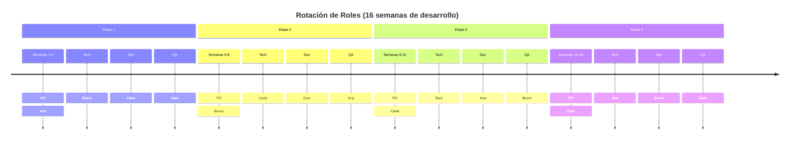

**Kit Completo de Kickoff** para el proyecto "Sistema Posgrado". Está diseñado para ejecutarse en las **primeras 3 semanas** de la materia (adaptando las 2 horas semanales disponibles) y establece las bases profesionales del proyecto.

---

# 🚀 KICKOFF PROJECT: Sistema POSTGRADO
**Fecha:** Semanas 1-3 del ciclo lectivo  
**Duración total:** 6 horas presenciales distribuidas + trabajo asíncrono  
**Modalidad:** Híbrida (Presencial obligatorio + Aula invertida)  

---

## 1. AGENDA DE LA CEREMONIA DE LANZAMIENTO

### Semana 1: El Problema y el Producto (2 horas)

| Tiempo | Actividad | Responsable | Entregable/Output |
|--------|-----------|-------------|-------------------|
| **0:00-0:15** | **Check-in & Contexto**<br>Presentación del caso real. Testimonial de la secretaria de posgrado explicando el dolor actual (Excel, carpetas, demoras). | Docente | Emocional alignment: "Esto es real, no un ejercicio" |
| **0:15-0:45** | **Visión del Producto**<br>Lectura del PRD Sección 1-3. Explicación del alcance MVP y arquitectura de módulos. | Product Owner (Docente) | Entrega física del PRD impreso a cada equipo |
| **0:45-1:15** | **Formación de Equipos**<br>Sorting de equipos (4 personas max). Asignación de módulo especializado por sorteo (B, C o D). | Scrum Master (Ayudante) | Lista de equipos publicada en pizarrón |
| **1:15-1:45** | **Taller: Arquitectura de Negocio**<br>Grupos analizan el BFD (Business Flow Diagram) y identifican:<br>• 3 puntos de dolor críticos<br>• 1 riesgo técnico evidente | Equipos + Mentor | Sticky notes en papelógrafo grupal |
| **1:45-2:00** | **Cierre & Setup Técnico**<br>Entrega de credenciales de acceso a GitHub Classroom, links a videos de aula invertida para la semana. | Tech Lead (Ayudante) | Checklist de herramientas firmado por cada estudiante |

### Semana 2: Técnico y Metodológico (2 horas)

| Tiempo | Actividad | Detalle |
|--------|-----------|---------|
| **0:00-0:30** | **Revisión Discovery**<br>Presentación de dudas del PRD. Clasificación de requisitos (MoSCoW en vivo). | Sesión de Q&A estructurada. Cada equipo pregunta 1 duda crítica. |
| **0:30-1:00** | **Workshop: Roles y Responsabilidades**<br>Definición de roles rotativos en el equipo (ver sección 3). Firma del "Team Charter". | Dinámica: Cada uno escribe su expectativa del rol del compañero a su derecha. |
| **1:00-1:30** | **Definición de Hecho (DoD)**<br>Construcción colectiva del Definition of Done. | Ver template en sección 5. Debe escribirse en un lienzo visible todo el cuatrimestre. |
| **1:30-2:00** | **Planificación de Release**<br>Presentación del roadmap de 32 semanas. Explicación de los 6 hitos de entrega. | Entrega de calendario académico con fechas de corte (freeze dates). |

### Semana 3: Sprint 0 - Fundación (2 horas)

| Tiempo | Actividad | Objetivo |
|--------|-----------|----------|
| **0:00-0:45** | **Taller de Arquitectura**<br>Diseño de la arquitectura de alto nivel (C4 - Nivel 1 y 2). Decisiones tecnológicas iniciales. | Cada equipo presenta su diagrama de contenedores (10 min por equipo). |
| **0:45-1:30** | **Setup de Desarrollo**<br>Taller hands-on: Clonar repo, levantar Docker Compose base, primer commit. | Validación: El `docker-compose up` debe funcionar en la máquina de cada integrante antes de irse. |
| **1:30-2:00** | **Grooming Inicial**<br>Creación del backlog inicial. Estimación relativa (story points) de las primeras 5 historias. | Backlog visible en GitHub Projects. |

---

## 2. ENTREGABLES DEL KICKOFF (Checklist de Salida)

Para considerar que el kickoff está completo, cada equipo debe entregar en la semana 3:

### Documentación (Repositorio Git)
- [ ] **README.md** con:
  - Nombre del equipo y logo (identidad)
  - Descripción del módulo asignado (Core+B/C/D)
  - Integrantes y roles rotativos (semanas 1-4, 5-8, etc.)
  - Stack tecnológico decidido (con justificación de 3 líneas)
  - Instrucciones exactas para levantar el entorno local (`git clone ... docker-compose up`)
  
- [ ] **/docs/ASR.md** (3 ASR mínimo definidos y aprobados por docente)
- [ ] **/docs/RFC/** (Al menos 1 RFC aprobado: elección de stack tecnológico)
- [ ] **/docs/Team_Charter.md** (Ver template sección 4)

### Infraestructura
- [ ] **Repositorio GitHub** creado desde GitHub Classroom (invitación enviada a todos los integrantes).
- [ ] **GitHub Projects** configurado con columnas: `Backlog | In Progress | Code Review | Done`.
- [ ] **Pipeline CI/CD base** funcionando (GitHub Actions): Al menos linting y build exitoso en cada PR.
- [ ] **Ambiente Local validado**: Captura de pantalla de la app corriendo en localhost (entregada en aula virtual).

### Planificación
- [ ] **Roadmap del Equipo** (Gantt simplificado o milestones de GitHub) con fechas de las 6 entregas.
- [ ] **Backlog inicial** poblado con al menos 15 historias de usuario refinadas (criterios de aceptación claros).

---

## 3. ESTRUCTURA DE EQUIPOS Y ROLES

### Composición del Equipo (4 personas)

**Nota:** Los roles rotan cada 4 semanas para que todos experimenten cada faceta.

| Rol | Responsabilidades durante su mandato | Entregables Específicos |
|-----|--------------------------------------|-------------------------|
| **Product Owner (PO)** | - Interfaz con el "cliente" (docente)<br>- Prioriza el backlog<br>- Escribe y refina historias<br>- Acepta/rechaza features | PRD actualizado, historias en GitHub Projects, minutas de reuniones de seguimiento |
| **Tech Lead/Arquitect** | - Decisiones técnicas (ASR, RFC)<br>- Code reviews obligatorios<br>- Integración de componentes<br>- Deuda técnica | Diagramas C4, ADRs (Architecture Decision Records), configuración de CI/CD |
| **Dev Lead (Senior Dev)** | - Gestión del repositorio (GitFlow)<br>- Pair programming<br>- Estimaciones técnicas<br>- Calidad de código (linting) | Historial de commits limpio, resolución de conflictos, documentación técnica |
| **QA/UX Lead** | - Definición de tests de aceptación<br>- Prototipos de interfaz (Figma/Balsamiq)<br>- Testing exploratorio<br>- Accesibilidad | Wireframes, casos de prueba, reporte de bugs, análisis de UX |

### Dinámica de Rotación



---

## 4. TEMPLATE: TEAM CHARTER (Contrato Social del Equipo)

Cada equipo debe completar y subir a `/docs/Team_Charter.md`:

```markdown
# Team Charter: [Nombre del Equipo]
**Módulo Asignado:** [Core+B / Core+C / Core+D]  
**Fecha:** ___/___/2026

## 1. Objetivo del Equipo
"Entregar un sistema de [módulo] que reemplace el proceso actual de [proceso específico], 
reduciendo el tiempo de [X] a [Y], manteniendo una calidad técnica medible en cobertura de tests >70%."

## 2. Acuerdos de Trabajo (Working Agreements)
- **Comunicación:** Usamos Discord/Slack con respuesta máxima de 4 horas en días hábiles.
- **Reuniones:** Daily virtual asíncrono (mensaje de texto en canal #daily), Weekly presencial 1h.
- **Código:** Todo código pasa por PR + Code Review antes de mergear a `main`.
- **Conflictos:** Si hay desacuerdo técnico >24h, se consulta al docente. No se bloquea el proyecto.
- **Calidad:** No mergeamos código que rompa el build o baje cobertura de tests.

## 3. Definición de Hecho (Definition of Done)
Compartida para todos los equipos del curso:
- [ ] Código mergeado a `main` via PR aprobado.
- [ ] Tests unitarios pasando (>70% cobertura nueva).
- [ ] Revisión de UX por al menos 1 compañero no desarrollador del feature.
- [ ] Documentación de API actualizada (Swagger).
- [ ] Desplegado en ambiente de staging y validado.

## 4. Riesgos del Equipo (Identificados en Kickoff)
| Riesgo | Probabilidad | Impacto | Mitigación |
|--------|--------------|---------|------------|
| [Ej: Rotura de BD local] | Media | Alto | Backups diarios automáticos con script |

## 5. Firmas (Compromiso)
- [ ] Product Owner: _______________
- [ ] Tech Lead: _______________
- [ ] Dev Lead: _______________
- [ ] QA/UX: _______________
```

---

## 5. TALLER PRÁCTICO: MAPEO DE DOLOR A SOLUCIÓN

### Ejercicio "El Día de la Secretaria" (30 minutos)

**Material:** Ficha de personaje (Ana, secretaria de posgrado), papelógrafo, post-its.

**Instrucciones:**
1. **5 min:** Leer en voz alta la ficha del usuario (ver abajo).
2. **10 min:** En equipo, identificar:
   - 3 momentos de "dolor agudo" (cuando Ana sufre/frustra).
   - 2 oportunidades de mejora digital obvias.
3. **10 min:** Dibujar el "antes y después" (AS-IS vs TO-BE) de uno de esos momentos.
4. **5 min:** Pitch rápido (1 min por equipo) explicando su solución dibujada.

**Ficha de Usuario (Entregar impresa):**
> **Ana Rodríguez**, 45 años, Secretaria de Posgrado UTN-FRLP.  
> **Su día:** Llega 8am con 15 mails de aspirantes. Cada uno pide información diferente. A las 10am, el profesor Gómez la llama porque perdió el Excel de asistencias y necesita los datos para el acta. A las 12m, viene un estudiante a preguntar si su legajo está completo; Ana tarda 20 min en encontrar la carpeta física.  
> **Frase:** *"Yo solo quiero que cuando abra la computadora, sepa exactamente quién necesita qué, sin buscar en 10 lados."*

---

## 6. CEREMONIAS Y RITMOS ESTABLECIDOS

Durante el kickoff se definen estas ceremonias fijas para todo el proyecto:

| Ceremonia | Frecuencia | Duración | Participantes | Objetivo |
|-----------|------------|----------|---------------|----------|
| **Daily Async** | Diaria (Lunes a Viernes) | 5 min (texto) | Solo equipo | Compartir: ¿Qué hice ayer? ¿Qué hago hoy? ¿Bloqueantes? |
| **Sprint Planning** | Cada 2 semanas | 1 hora | Equipo + Docente (observador) | Seleccionar historias del backlog para las próximas 2 semanas. |
| **Review Técnica** | Semana 5, 9, 13, 17 | 30 min por equipo | Equipo + Ayudante | Demo de lo funcionado. Feedback temprano. |
| **Retrospectiva** | Cada 4 semanas (con rotación de roles) | 45 min | Solo equipo | ¿Qué seguimos? ¿Qué mejoramos? ¿Qué dejamos? |
| **Clínica de Código** | Semanas pares (jueves) | 1 hora | Todo el curso | Traer código roto o dudoso, revisión colectiva guiada por docente. |

---

## 7. Stack tecnologico (Toolbox)

Entregar una checklist de setup a cada estudiante:

### Stack Sugerido (No obligatorio, pero soportado por la cátedra)
- **Frontend:** React 18 + TypeScript + Vite + TailwindCSS
- **Backend:** Node.js (Express/NestJS) **o** Python (FastAPI) - decisión del equipo
- **BD:** PostgreSQL 15 (via Docker)
- **ORM:** Prisma (Node) o SQLAlchemy (Python)
- **Testing:** Vitest/Jest (Frontend), Pytest/Jest (Backend), Playwright (E2E)
- **DevOps:** Docker, Docker Compose, GitHub Actions

### Accesos a Crear en Semana 1
- [ ] Cuenta GitHub (si no tiene) + acceso a GitHub Classroom
- [ ] Fork del proyecto en el repositorio de la materia 
- [ ] Cuenta GitHub Discussion (canal privado por equipo)
- [ ] Cuenta Figma (para wireframes)
- [ ] Acceso al Drive compartido con documentación base (PRD, BFD, Mockups)

---

## 8. CRITERIOS DE ÉXITO DEL KICKOFF (Evaluación)

El kickoff se considera exitoso si al finalizar la semana 3:

1. **100% de los equipos** tienen el repo clonable y levantable con un comando (`docker-compose up`).
2. **100% de los estudiantes** conocen su rol actual y sus responsabilidades específicas para las próximas 4 semanas.
3. **Cada equipo** ha identificado y documentado al menos 2 ASR críticos para su módulo.
4. **Se ha establecido** el Definition of Done compartido y está visible físicamente en el aula o digitalmente en el repo.
5. **Se ha realizado** al menos 1 práctica de comunicación efectiva (el ejercicio del Día de la Secretaria o similar).

---

## 9. MENSAJE CLAVE DEL DOCENTE (Script Sugerido)

> *"Bienvenidos a la industria. Durante los próximos meses no son alumnos haciendo una tarea; son ingenieros de software resolviendo un problema real de esta facultad. Van a fallar, van a tener conflictos de integración, van a querer tirar todo por la ventana en la semana 10. Eso es normal. Lo que les pido es que se comporten como profesionales: compromiso con el equipo, comunicación temprana cuando algo se rompe, y entregas que funcionen. No busco código perfecto, busco decisiones justificadas y un producto que la secretaria Ana pueda usar sin llamarme por teléfono para preguntar cómo se hace. ¿Jugamos?"*

---

## Anexos para Imprimir (Handouts)

### Anexo A: Glosario Rápido (Tarjeta de Bolsillo)
- **User Story:** Como [rol] quiero [acción] para [beneficio].
- **AC:** Acceptance Criteria (criterios de aceptación).
- **ASR:** Requisito Arquitectónicamente Significativo (lo que hace complejo el sistema).
- **DoD:** Definition of Done (cuándo consideramos terminada una tarea).
- **MVP:** Producto Mínimo Viable (lo mínimo que resuelve el problema).

### Anexo B: Calendario Visual
```
SEMANAS 1-4:   [KICKOFF] Discovery + Setup
SEMANAS 5-9:   [SPRINT 1] Core Funcional (Inscripción)
SEMANA 10:     [REVIEW 1] Demo intermedia
SEMANAS 11-15: [SPRINT 2] Core Avanzado + Inicio Módulo
SEMANA 16:     [ENTREGA PARCIAL] Tag v0.5
SEMANAS 17-23: [SPRINT 3] Módulo Especializado
SEMANAS 24-27: [HARDENING] Testing + Seguridad
SEMANA 28:     [ENTREGA FINAL] Tag v1.0
SEMANAS 29-32: [CIERRE] Documentación + Exposiciones
```

---
